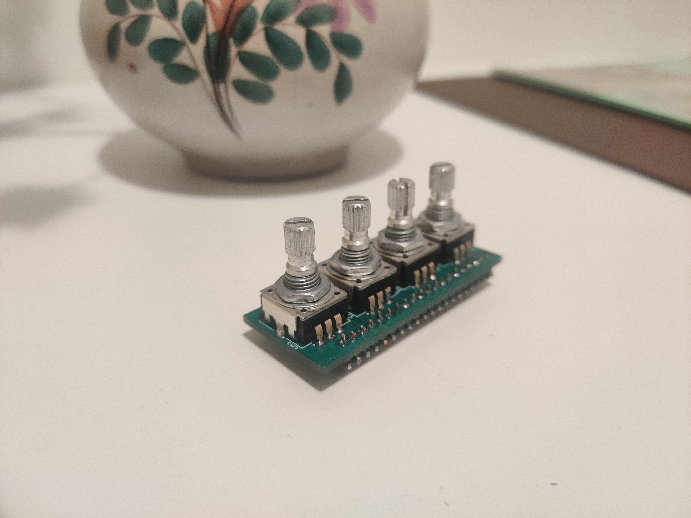

# Mico - A tiny, cheap Raspberry Pi Pico midi controller


 

Mico is a small, cheap (~10 euros total) and super precise 14 bit midi controller based on the [Raspberry Pi Pico board](https://www.raspberrypi.com/products/raspberry-pi-pico/).

## Features
- 4 x detentless (smooth) encoders 
- Velocity: Slow movements result in microscopic changes (1/16000 of the max range approximately), fast movements in large changes.
- A variety of "clip modes" (cycle through them by pressing the button):
 	- wrap (when the value goes above max, it wraps back to 0) 
 	- clamp (clip at min and max value)
- 14 bit midi (as well as regular 7 bit midi)
- Cheap as chips and open sourced

## BOM

| Quantity | Part | Mouser Number |
|---|---|---|
| 1 | Raspberry Pi Pico rpi2040 | [474-DEV-17829](https://no.mouser.com/ProductDetail/SparkFun/DEV-17829?qs=sGAEpiMZZMv0NwlthflBi8NxDpSYKEiM3fbb2%2FVBX4k%3D) |
| 8 | 0.01uF capacitor, 0603 | [80-C0603C103M5R7411](https://no.mouser.com/ProductDetail/KEMET/C0603C103M5RAC7411?qs=ACslrEyEXNOtANB4TBkCnQ%3D%3D) |
| 16 | 10k resistors, 1%, 0603 | [603-RC0603FR-0710KL](https://no.mouser.com/ProductDetail/YAGEO/RC0603FR-0710KL?qs=sGAEpiMZZMtlubZbdhIBIAhzU1Tw%252BHVakiDuQ4Zki0U%3D) |
| 4 | 15mm Detentless encoders | [652-PEC11R-4015K-N24](https://no.mouser.com/ProductDetail/652-PEC11R-4015K-N24)(knurled) / [PEC11R-4015F-N0024](https://no.mouser.com/ProductDetail/Bourns/PEC11R-4015F-N0024)(flat) |
| 2 | Female header (to sandwich between the boards)| n/a |
| 2 | Male header (to sandwich between the boards) | n/a |


## Uploading the firmware

Download the latest firmware from the release and locate the `mico.uf2` file. While plugging your Pico into your computer, press and hold the "BOOTSEL" button. It will show up as a storage device on your computer. Copy `mico.uf2` to this device. Done.


## Building and uploading the firmware (optional)

If you want to build the code and mess around with it, it is recommended to use a second Pico flashed with the [picoprobe](https://github.com/raspberrypi/picoprobe) firmware.

### Using picoprobe

```bash
cd software
mkdir build
cd build 
cmake ..
make && openocd -f interface/picoprobe.cfg -f target/rp2040.cfg -c "program mico.elf verify reset exit"
```
Debug:
```bash
openocd -f interface/picoprobe.cfg -f target/rp2040.cfg -s tcl
```

## Usage

### SuperCollider

There is an easy to use interface for this controller [here](https://github.com/madskjeldgaard/mico-sc).

## License

This work is shared under the *Attribution-NonCommercial-ShareAlike 4.0 International* license.

If you have questions about that, send me an email **mail at madskjeldgaard.dk**

## Credits

These projects were a big help and inspiration in making this:
- [schatzmann blog](https://www.pschatzmann.ch/home/2021/02/15/usb-midi-on-the-arduino-pico/) and [also this post](https://www.pschatzmann.ch/home/2021/02/19/tinyusb-a-simple-tutorial/)
- [pico-example-midi](https://github.com/infovore/pico-example-midi)
- [encoder-pio](https://github.com/pimoroni/pimoroni-pico) is from the pimoroni-pico library. MIT Licensed.
